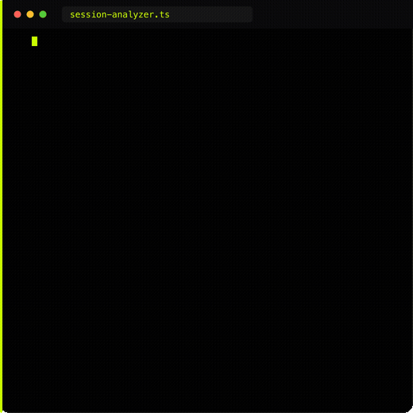

<table>
<tr>
<td valign="top" width="50%">

```ts
// braintied/watchtower · src/webhook/session.ts

const SessionWebhookSchema = z.object({
  session_key: z.string(),
  source: z.enum([
    'claude_code', 'cursor', 'codex', 'gemini',
  ]).default('claude_code'),
  project_slug: z.string().optional(),
  messages: z.array(SessionWebhookMessageSchema).optional(),
  files_touched: z.array(z.string()).optional(),
  tools_used: z.array(z.string()).optional(),
});

export async function handleSessionWebhook(c: Context): Promise<Response> {
  const parseResult = SessionWebhookSchema.safeParse(jsonBody);
  // ... redact, insert ...
  await inngest.send({
    name: 'watchtower/coding-session.received',
    data: {
      session_id: insertedData.id,
      project_slug: projectSlug,
    },
  });
  return c.json({ status: 'ok', session_id: insertedData.id });
}
```

</td>
<td valign="top" width="50%">



</td>
</tr>
</table>
